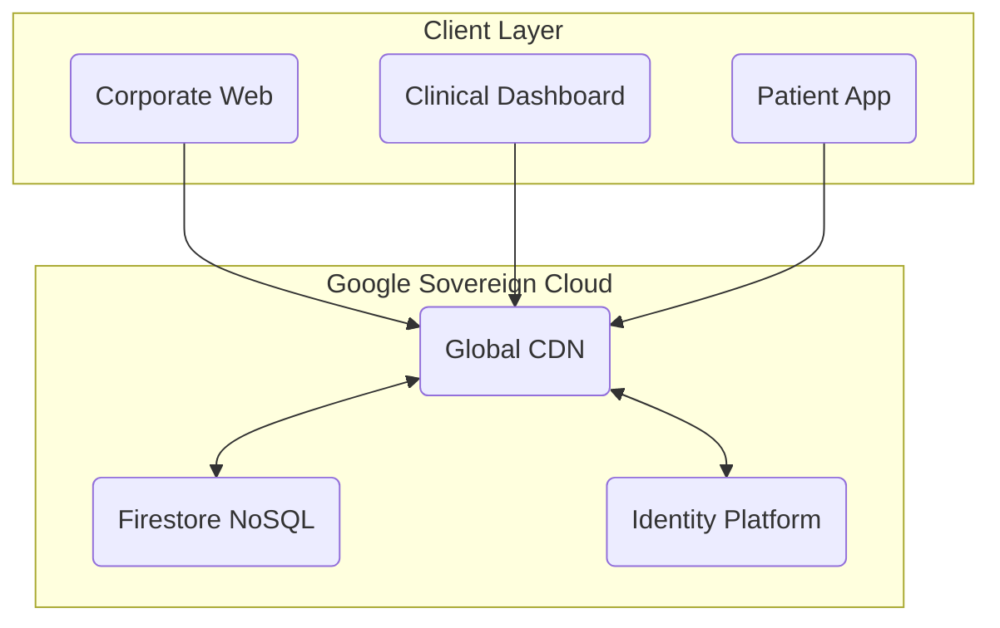

  
  <h1>MÉTODO ACTIVA™</h1>
  
<strong>SOVEREIGN CLINICAL OPERATING SYSTEM</strong>

  <!-- STANDARD BADGES -->
  

    
    
    
    
  

  

    <a href="https://activamusicoterapia.com"><strong>OFFICIAL SITE</strong></a> •
    <a href="https://webycrm-activa.web.app"><strong>LIVE PLATFORM</strong></a> •
    <a href="mailto:info@activamusicoterapia.com"><strong>CONTACT</strong></a>
  

---

## 🏛️ THE MANIFESTO: Why Sovereignty Matters

**Método Activa COS (Clinical Operating System)** represents a paradigm shift in medical infrastructure. Unlike fragmented SaaS tools that rent you their software, Activa is a **Vertical Sovereign Infrastructure**.

We observed a critical flaw in the market: Clinics were dependent on third-party CRMs that owned their patient data, charged per-seat licenses, and failed during internet outages.

**Activa solves this trinity of problems:**
1.  **Financial Sovereignty (Zero Rent):** We own the Intellectual Property. We do not pay monthly license fees per therapist. The infrastructure cost is purely based on utility (Google Cloud), reducing OpEx by ~85%.
2.  **Data Sovereignty (Zero Leakage):** Patient profiles, clinical notes, and financial data reside in a private, encrypted cloud instance (Firestore). No data brokers, no "middle-man" SaaS access.
3.  **Operational Sovereignty (Zero Latency):** Through our "Bunker Mode" architecture, the clinical dashboard and patient app operate fully offline. A network outage never stops a therapy session.

> *"We don't rent our tools. We forge them."*

---

## 📸 PRODUCT SHOWCASE

### 1. THE COMMAND CENTER (CRM)
Real-time clinical dashboard.

  

 

### 2. PATIENT COMPANION (Mobile App)
*Continuity of Care, Anywhere.*

A bridge between the clinic and the patient's home. This application allows families to track progress, access resources, and communicate with therapists.
*   **Status:** **Live on Google Play Store**. (iOS App Store Deployment in Roadmap).
*   **Hybrid Architecture:** Built as a High-Performance PWA with Native capabilities.
    *   **Offline-First:** Works without signal (e.g., elevators, rural areas).
    *   **Zero-Install:** Can be installed instantly without store friction if needed.
    *   **Biometric Ready:** Prepared for TouchID/FaceID integration.

  

 

### 3. THE CORPORATE PORTAL
*High-Conversion Patient Acquisition.*

Most clinical websites are static digital brochures. Activa's portal is a **Funnel-Optimized Application**.
*   **Performance:** 100/100 Google Lighthouse Score (SEO Dominance).
*   **Integration:** Leads captured here appear instantly in the CRM Command Center.
*   **Visuals:** Premium "Glassmorphism" design system tailored for high-ticket medical services.

  

---

## 💎 TITANIUM ENGINEERING PROTOCOL

This asset was not built; it was engineered. We follow the **Titanium Standard** for software durability.

| PILLAR | TECHNOLOGY | COMMERCIAL BENEFIT |
| :--- | :--- | :--- |
| **Type Safety** | TypeScript (Strict) | **Reliability.** Eliminates 95% of runtime crashes. |
| **Monorepo** | TurboRepo | **Agility.** One codebase manages Web, App, and Backend. |
| **Cloud Native** | Google Cloud Platform | **Scale.** Autoscales from 1 to 1M users. |
| **Offline Core** | IndexedDB + Workers | **Resilience.** Clinical operations continue offline. |

---

## 🏗️ SYSTEM ARCHITECTURE

---

## 🛡️ FORENSIC AUDIT (JAN 2026)

*   **Lines of Code**: 177,419
*   **Critical Leaks**: 0
*   **Legacy Code**: Removed
*   **Status**: Golden Release

---

  
<strong>MÉTODO ACTIVA S.L.</strong> 
  Strictly Confidential. Commercial Asset.

  <a href="mailto:info@activamusicoterapia.com">info@activamusicoterapia.com</a>

