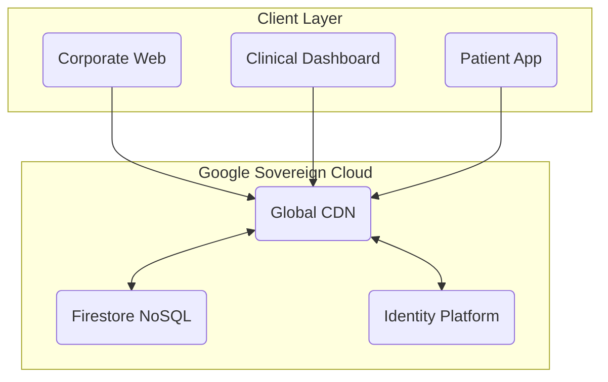

  
  <h1>MÉTODO ACTIVA™</h1>
  
<strong>SOVEREIGN CLINICAL OPERATING SYSTEM</strong>

  <!-- STANDARD BADGES -->
  

    
    
    
  

  

    <a href="https://activamusicoterapia.com"><strong>OFFICIAL SITE</strong></a> •
    <a href="https://webycrm-activa.web.app"><strong>LIVE PLATFORM</strong></a> •
    <a href="mailto:info@activamusicoterapia.com"><strong>CONTACT</strong></a>
  

---

## 🏛️ THE MANIFESTO

**Método Activa COS (Clinical Operating System)** is a vertical infrastructure engineered for high-performance Neurorehabilitation.

*   **Zero Rent**: We own the code. No per-seat licenses.
*   **Zero Leakage**: Patient data remains in our sovereign cloud.
*   **Zero Latency**: Offline-first architecture ("Bunker Mode").

> *"We don't rent our tools. We forge them."*

---

## 📸 PRODUCT SHOWCASE

### 1. THE COMMAND CENTER (CRM)
Real-time clinical dashboard.

  

 

### 2. PATIENT COMPANION (Mobile PWA)
Native-grade performance on iOS & Android. Offline-first architecture for continuity of care.

  

 

### 3. THE CORPORATE PORTAL
High-conversion patient acquisition.

  

---

## 💎 TITANIUM ENGINEERING

This project follows the **Titanium Protocol**:

| PILLAR | TECHNOLOGY | BENEFIT |
| :--- | :--- | :--- |
| **Language** | TypeScript (Strict) | 0% Runtime Crashes |
| **Data** | Firestore + Security Rules | Zero-Trust Security |
| **Continuity** | IndexedDB (Offline) | Works without Internet |
| **Deploy** | GitHub Actions | Automated & Atomic |

---

## 🏗️ SYSTEM ARCHITECTURE

---

## 🛡️ FORENSIC AUDIT (JAN 2026)

*   **Lines of Code**: 177,419
*   **Critical Leaks**: 0
*   **Legacy Code**: Removed
*   **Status**: Golden Release

---

  
<strong>MÉTODO ACTIVA S.L.</strong> 
  Strictly Confidential. Commercial Asset.

  <a href="mailto:info@activamusicoterapia.com">info@activamusicoterapia.com</a>

