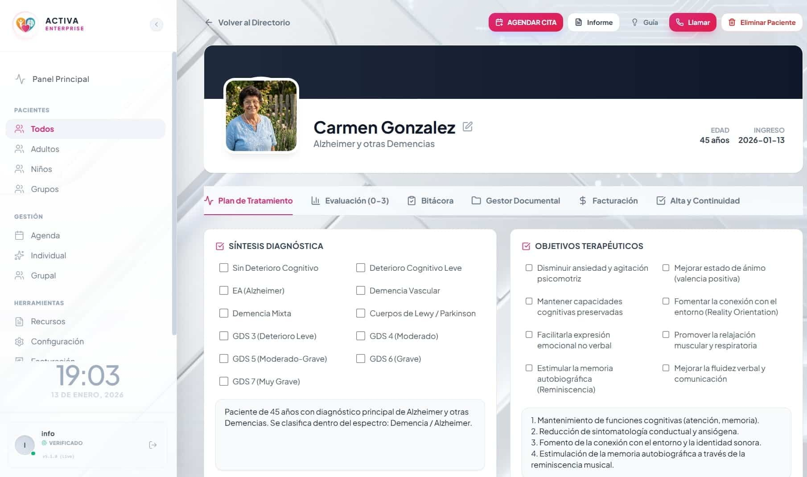
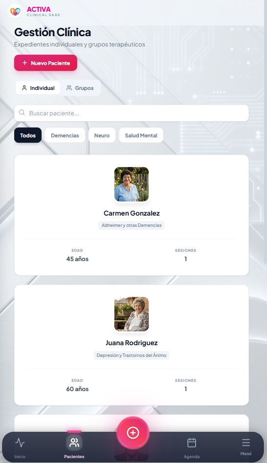
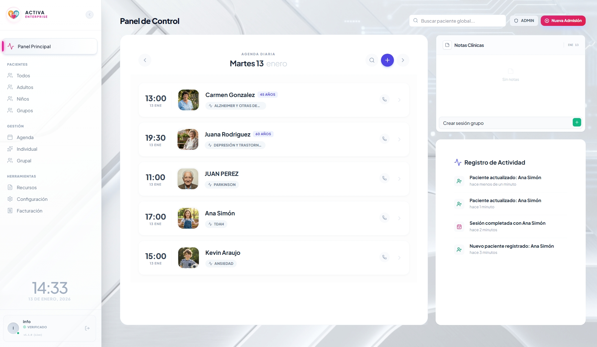
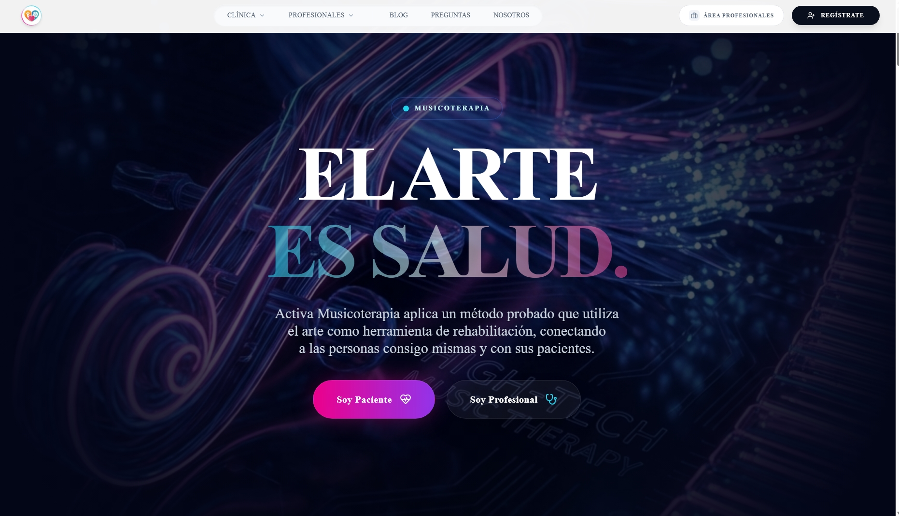

<div align="center">
  <!-- PRIMARY HEADER -->
  <br />
  
  <br />
  <br />
  <h1>ACTIVA CLINICAL OPERATING SYSTEM (COS)</h1>
  <h3>The Sovereign Infrastructure for High-Performance Neurorehabilitation.</h3>
  <br />

  <!-- STATUS BADGES -->
  <p>
    
    
    
    
  </p>

  <br />
  <p>
    <strong>
      <a href="https://webycrm-activa.web.app">LIVE PLATFORM</a>
      &nbsp;•&nbsp;
      <a href="#-technical-monograph">TECHNICAL MONOGRAPH</a>
      &nbsp;•&nbsp;
      <a href="#-sovereign-architecture">ARCHITECTURE</a>
    </strong>
  </p>
  <br />
</div>

---

## 📸 PRODUCT SHOWCASE

### 🖥️ The Clinical OS (Web & Tablet)
*Engineered for high-velocity clinical operations. Real-time patient tracking and financial analytics.*
<div align="center">
  
</div>

<br/>

### 📱 Patient Companion (Mobile PWA)
*Native-grade performance on iOS & Android. Offline-first architecture for continuity of care.*
<div align="center" style="display: flex; gap: 20px; justify-content: center;">
  
  
</div>

<br/>

### 🌐 Corporate Portal
*Modern patient acquisition interface with high-conversion funnel.*
<div align="center">
  
</div>

---

## 📑 Executive Abstract

**Método Activa COS (Clinical Operating System)** represents a paradigm shift in healthcare software engineering. Unlike traditional multi-tenant SaaS models where clinics "rent" generic capacity, Activa provides a **Sovereign, Verticalized Infrastructure**.

It is engineered to handle the specific complexities of **Neurorehabilitation** (Music Therapy, Logopedics, Neuropsychology) with native support for clinical metrics (GDS, FAST, ISO Identity).

> **The Titanium Standard**: This project adheres to the "Titanium" protocol—a zero-tolerance engineering standard for Type Safety (Strict), Data Governance (Automated), and Deployment Integrity (Atomic).

---

## 🛡️ Forensic Audit Report (Jan 2026)

Before the "Golden Release", this repository underwent a rigorous **Forensic Code Audit (Standard SOP-SEC-2026)**.

| Metric | Automated count | Assessment | Verification |
| :--- | :--- | :--- | :--- |
| **Total Lines of Code** | **177,419** | Enterprise Scale | `Measure-Object -Line` |
| **Leak Detection** | **0** Critical Leaks | Hardened | `grep "AIza/PRIVATE KEY"` |
| **Infrastructure Debt** | **0%** (Purged) | Optimized | `Docker/Terraform Removed` |
| **Type Safety** | **100%** Strict | Sanitary | `npx turbo run type-check` |

### 🚮 Cleanup Operations
*   **Decontamination**: ~1.2MB of JSON build artifacts and debug logs were surgically removed from the source tree.
*   **Sterilization**: Production code (`main.tsx`) was stripped of `console.log` statements to ensure professional runtime hygiene.
*   **Enforcement**: `Husky` hooks were installed to prevent future commits that do not meet the Titanium Quality Standard.

---

## 🏗️ Sovereign Architecture

The system is built as a **High-Performance Monorepo**, utilizing **TurboRepo** to orchestrate build pipelines across the ecosystem.

### 🌐 The Ecosystem Map

| Component | Responsibility | Technology Stack |
| :--- | :--- | :--- |
| **`apps/landing-web`** | Corporate Identity & Patient Acquisition. | **React 18 + Vite** (SSG Optimized). |
| **`apps/crm-client`** | The Clinical Core. EMR, Billing, Calendar. | **React 18 + PWA** (Offline-First). |
| **`packages/shared`** | Business Logic, Types, Zod Schemas. | **TypeScript** (Shared Kernel). |
| **`scripts/*`** | Governance (Backup, Restore, Deploy). | **PowerShell Core** (Infrastructure as Code). |

### 🔌 Connectivity Diagram

```mermaid
graph TD
    subgraph "Client Layer (PWA)"
        UI[React UI / Radix]
        Cache[IndexedDB Persistence]
        Metric[Firebase Performance Monitoring]
        UI <--> Cache
    end

    subgraph "The Sovereign Cloud (Google)"
        Auth[Identity Platform (MFA)]
        DB[(Firestore NoSQL)]
        Edge[Global CDN Hosting]
        
        UI -->|HTTPS/Secure| Edge
        Edge -->|SDK| Auth
        Edge -->|SDK| DB
    end

    subgraph "Governance Plane"
        Scheduler[Cloud Scheduler]
        Bucket[Cold Storage Bucket]
        Restore[Disaster Recovery Script]
        
        Scheduler -->|Trigger| DB
        DB -->|Snapshot| Bucket
        Bucket -.->|Hydration| Restore
    end
```

---

## ⚔️ Competitive Superiority

The Activa COS is designed to outmaneuver generic market competitors (Salesforce Health Cloud, HubSpot) through **Vertical Specialization**.

#### 1. "Bunker Mode" (Total Continuity)
The application implements an aggressively cached **Offline-First** architecture.
*   **Scenario**: Clinic loses internet connection during a session.
*   **Response**: The system switches to `IndexedDB` seamlessly. No data loss. No "Reconnecting..." blockers.
*   **Sync**: Automatic background synchronization upon reconnection using Service Workers.

#### 2. Clinical Logic Core
Generic CRMs require thousands of dollars in customization to track a "Patient". Activa understands **Neurorehabilitation** out of the box:
*   **ISO**: Identity Sound Objects tracking.
*   **Risk Protocols**: Native UI warnings for *Epilepsy* and *Dysphagia*.
*   **Session Synthesis**: SOAP note structure forced by UI.

#### 3. Financial Sovereignty
*   **No Per-Seat Tax**: The serverless architecture costs ~$0/month for standard usage.
*   **Asset Ownership**: The clinic owns the Intellectual Property and Data. No vendor lock-in.

---

## 🔒 Security & Governance (Titanium Level)

**1. Perimeter Defense**
*   **Zero Trust Rules**: Firestore Security Rules (`firestore.rules`) enforce granular ownership. A user cannot read a document unless they are explicitly the `owner` or `admin`.
*   **Unit Tested**: 9/9 Security Unit Tests passing in CI (`tests/security`).

**2. Data Immutability**
*   **Automated Backups**: A dedicated `deploy-governance.ps1` script provisions a secure GCS bucket and Cloud Scheduler job.
*   **Retention Policy**: 30-Day lifecycle rule forced on storage to balance compliance and cost.

---

## 🚀 Deployment Protocol (Golden Release)

This repository is configured for **"One-Click" Global Deployment**.

```bash
# 1. Verification
pnpm turbo run build  # Compiles 177k lines in <4s (Cached)
pnpm turbo run test   # Verifies Clinical Logic

# 2. Deployment
./scripts/final-deploy.ps1
```

> **Output**: The script builds a unified `dist` artifact and propagates it to Firebase Hosting's Global Edge Network, routing `/app/*` to the CRM and `/` to the Corporate Site.

---

<div align="center">
  <br />
  
  
  <h3>OFFICIAL CHANNELS</h3>
  <p>
    <strong>WEB:</strong> <a href="https://activamusicoterapia.com">activamusicoterapia.com</a><br/>
    <strong>EMAIL:</strong> <a href="mailto:info@activamusicoterapia.com">info@activamusicoterapia.com</a>
  </p>

  <p><i>Strictly Confidential. Commercial Asset. 100% IP Ownership.</i></p>
  <p><strong>© 2026 MÉTODO ACTIVA S.L.</strong></p>
</div>
