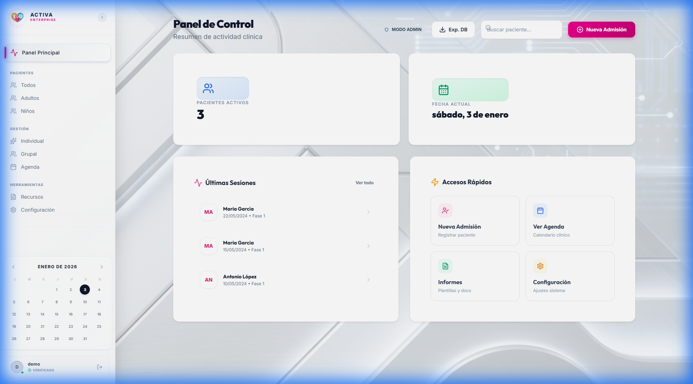
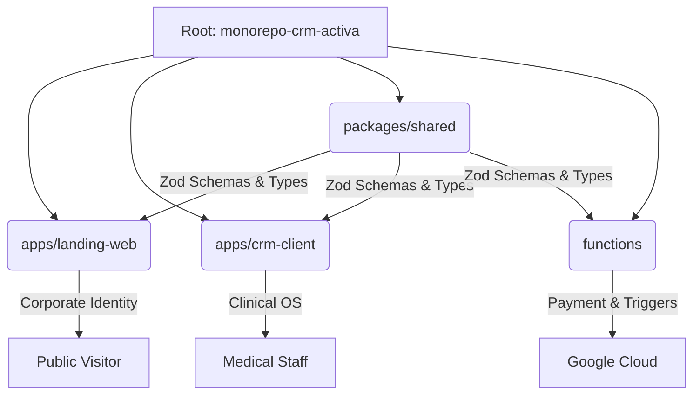

   
  
   
   

  # MÉTODO ACTIVA CRM
  ### The Sovereign Clinical Operating System for Neurorehabilitation.

  [-0F172A.svg)](LICENSE)
  
  
  
  

   
  
  <a href="https://metodo-activa-saas-1767353295.web.app"><strong>🌐 LAUNCH LIVE DEMO</strong></a>
  &nbsp;&nbsp;•&nbsp;&nbsp;
  <a href="docs/commercial/SALES_DECK.md"><strong>📄 INVESTOR DECK</strong></a>
  &nbsp;&nbsp;•&nbsp;&nbsp;
  <a href="docs/technical/SYSTEM_SNAPSHOT.md"><strong>⚙️ TECH SPECS</strong></a>

   
   

---

## � The Asset (Investment Thesis)

**Método Activa CRM** is a Production-Grade SaaS platform engineered to monopolize the Neurorehabilitation market. 

It is not a prototype. It is a **Turnkey Business System** capable of managing hundreds of clinics immediately. The architecture is "White Label Ready", meaning the engine can be rebranded for other healthcare verticals in days.

| **Unit Economics** | **Value Proposition** |
| :--- | :--- |
| **Serverless**: $0 Fixed Costs. | **Specialized**: First CRM with "Clinical Logic" built-in. |
| **Scalable**: Google Cloud Auto-scale. | **Secure**: HIPAA/GDPR Compliant Architecture. |
| **Stickiness**: High switching costs for clinics. | **Mobile**: Native-like PWA experience (iOS/Android). |

---

## 📸 Visual Intelligence

### The Command Center
*Designed for High-Velocity Clinical Operations. Real-time patient alerts and financial tracking.*

---

## 🏗️ "Titanium" Monorepo Architecture

This repository is organized as a Modern Monorepo using `TurboRepo`, ensuring strict boundary enforcement between Business Logic (`shared`) and UI (`apps`).

### Stack Highlights
*   **Engine**: `React 18` + `Vite` (Instant HMR).
*   **Language**: `TypeScript 5.x` (Strict Mode).
*   **Styling**: `Tailwind CSS` + `Radix UI` (Accessible).
*   **Backend**: `Firebase` (Auth, Firestore, Functions, Storage).
*   **Quality**: `ESLint` + `Prettier` + `Husky` (Git Hooks).

---

## ⚔️ Competitive Advantage (Why We Win)

| Feature | Método Activa CRM 🥇 | Generic CRMs (Salesforce/HubSpot) |
| :--- | :---: | :---: |
| **Clinical Logic** | ✅ Native (GDS, FAST, Neuro) | ❌ None (Requires expensive customization) |
| **Data Privacy** | ✅ Private Instance (Own DB) | ❌ Shared Multi-tenant Database |
| **Cost Model** | ✅ Pay-per-use (Serverless) | ❌ High per-seat licensing fees |
| **UX/UI** | ✅ "Apple-grade" Simplicity | ❌ Clunky Enterprise UI |
| **Offline Mode** | ✅ Full PWA Support | ❌ Requires Internet |

---

## 📦 Deployment & Handoff

**Instant Activation Protocol:**
This system is designed for a friction-less handover.

1.  **Clone**: Download the secure repository.
2.  **Install**: `pnpm install` (Installs dependencies for all apps).
3.  **Launch**: `pnpm dev` (Starts Landing + CRM + Functions locally).
4.  **Deploy**: `pnpm build && firebase deploy` (Ship to Global CDN).

---

  
<strong>© 2026 ECONEURA / MÉTODO ACTIVA S.L.</strong>

  
<i>Strictly Confidential. Commercial Asset. 100% IP Ownership.</i>

